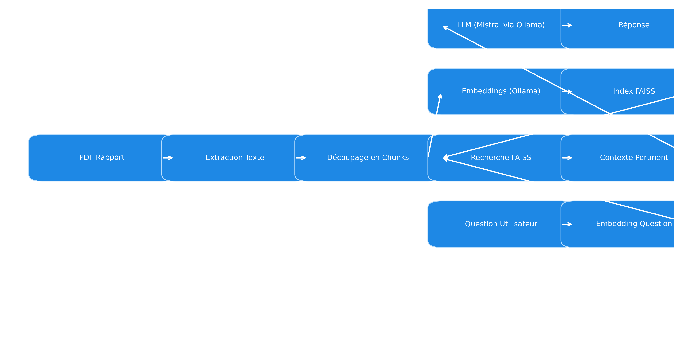

# 🤖 Chatbot RAG — Économie Française  

Un assistant IA capable d’analyser et d’interroger un rapport PDF en langage naturel.
Grâce à une architecture RAG (Retrieval-Augmented Generation), le chatbot combine recherche d’information et génération de texte pour fournir des réponses précises et contextualisées.

## Points clés
- Ollama (Mistral) → Modèle de langage open-source pour embeddings & génération
- FAISS → Recherche vectorielle rapide et efficace
- Streamlit → Interface web interactive et simple à utiliser

## Fonctionnalités
- Extraction et découpage automatique d’un PDF
- Création d’embeddings avec mistral
- Indexation avec FAISS
- Recherche vectorielle des chunks pertinents
- Génération de réponse contextualisée avec un LLM
- Interface web interactive avec Streamlit

## Architecture du pipeline
Organigramme TD
   - A[PDF Rapport] --> B[Extraction Texte]
   - B --> C[Découpage en Chunks]
   -  C --> D[Embeddings (Ollama)]
   -  D --> E[FAISS Index]
   -  F[Question Utilisateur] --> G[Embedding Question]
   -  G --> H[Recherche FAISS]
   - H --> I[Contexte Pertinent]
   - I --> J[LLM (Mistral via Ollama)]
   - J --> K[Réponse Contextualisée]
   - K --> L[Interface Streamlit]
    

